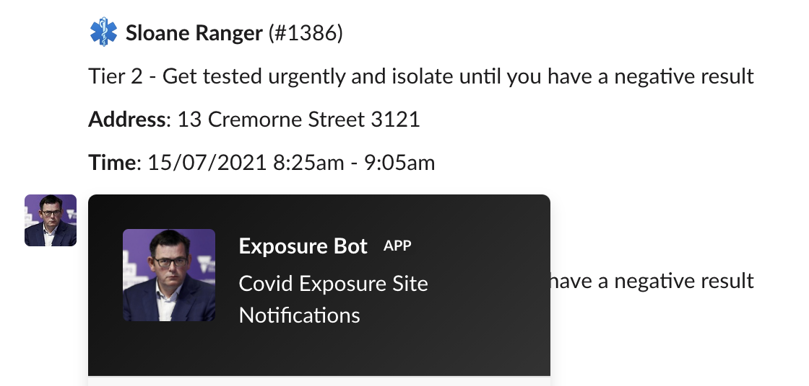

# Victoria Exposure Site Bot

## Features

- Downloads the Victoria exposure site CSV.
- Saves the exposure sites to an SQLite database.
- Notifies a Slack channel of the exposure site once.

## Screenshots



## Layout

```
tree lib 
lib
├── models
│   └── site.rb
├── process.rb
└── services
    ├── download.rb
    ├── notify_slack.rb
    └── save.rb

2 directories, 5 files
```

## Usage

```
./exe/exposure-bot \
  --csv-url=https://docs.google.com/spreadsheets/d/e/2PACX-1vSNouXrJ8UQ-tn6bAxzrOdLINuoOtn01fSjooql0O3XQlj4_ldFiglzOmDm--t2jy1k-ABK6LMzPScs/pub\?gid\=1075463302\&single\=true\&output\=csv \
  --database=/tmp/test.db \
  --slack-url=https://hooks.slack.com/services/XXX/XXX/XXX
```
